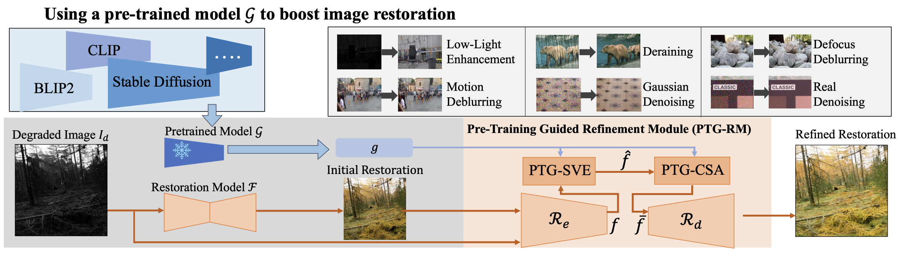

# Boosting Image Restoration via Priors from Pre-trained Models

This is a pytorch project for the paper **Boosting Image Restoration via Priors from Pre-trained Models** by Xiaogang Xu, Shu Kong, Tao Hu, Zhe Liu, and Hujun Bao presented at **CVPR2024**.


## Introduction
This paper proposes to learn an additional lightweight module called Pre-Train-Guided Refinement Module (PTG-RM) to refine restoration results of a target restoration network with off-the-shelf features (OSF) from pretrained models.
PTG-RM consists of two components Pre-Train-Guided Spatial-Varying Enhancement (PTG-SVE) and Pre-Train-Guided Channel-Spatial Attention (PTG-CSA). PTG-SVE enables optimal short-and long-range neural operations while PTG-CSA enhances spatial-channel attention for restoration-related learning. 



[paper link](https://openaccess.thecvf.com/content/CVPR2024/papers/Xu_Boosting_Image_Restoration_via_Priors_from_Pre-trained_Models_CVPR_2024_paper.pdf)


## Project Setup

First install Python 3. We advise you to install Python 3 and PyTorch with Anaconda:

```
conda create --name py36 python=3.6
source activate py36
```

Clone the repo and install the complementary requirements:
```
cd $HOME
git clone --recursive git@github.com:xiaogang00/pretrain_model_boost_restoration.git
cd pretrain_model_boost_restoration
pip install -r requirements.txt
```

Meanwhile, you should also install the dependency of pretrained models, like CLIP (https://github.com/openai/CLIP).

## Usage

### Train

First, download the dataset. Take the dataset of SID in the low-light image enhancement task as an example, where we adopt CLIP as the pre-trained model (https://github.com/openai/CLIP, and we employ ViT-B/32 here).

Install the dependency of CLIP according to https://github.com/openai/CLIP, and download the corresponding checkpoint.

You can download the SID dataset from [baidu pan](https://pan.baidu.com/s/1HRr-5LJO0V0CWqtoctQp9w) (验证码: gplv), and there should contain "long_sid2" and "short_sid2".

Train the model on the corresponding dataset using the train config.
For example, the training on SID:
```
python -m torch.distributed.launch --nproc_per_node 1 --master_port 4320 train.py -opt options/train/SID.yml --launcher pytorch
```

### Test

We use PSNR and SSIM as the metrics for evaluation. Evaluate the model on the corresponding dataset using the test config.

For instance, for the evaluation on SID (low-light image enhancement task and the pretrained model is CLIP ViT-B/32), you can download the pretrained model on SID (the link is https://drive.google.com/file/d/1rHAPuGyu3gV_6Mb8SFEBC_i0y7tmlsOp/view?usp=share_link) or use the trained model by yourself, writing the location of checkpoint in ``pretrain_model_G" of options/test/SID.yml
use the following command line:
```
python test.py -opt options/test/SID.yml
```

## Citation Information

If you find the project useful, please cite:

```
@inproceedings{xu2024boosting,
  title={Boosting image restoration via priors from pre-trained models},
  author={Xu, Xiaogang and Kong, Shu and Hu, Tao and Liu, Zhe and Bao, Hujun},
  booktitle={Proceedings of the IEEE/CVF conference on computer vision and pattern recognition},
  pages={2900--2909},
  year={2024}
}
```

## Contributions
If you have any questions/comments/bug reports, feel free to e-mail the author Xiaogang Xu ([xiaogangxu00@gmail.com](xiaogangxu00@gmail.com)).
